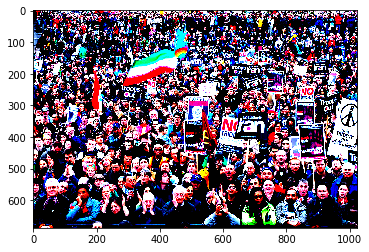

<h1> Crowd Density Estimation </h1>

<h3> Task: </h3> Find out how many people are there based on a set density based on the image 
segmentation result.   

<h3> About </h3>

 The main objective of this project is to estimate the number of people in an image, like in a image of stadium, market etc.   The Architecture used in this model is CSRnet. CSRNet uses VGG-16 as the front end because of its strong transfer learning ability. The output size from VGG is ⅛th of the original input size. CSRNet also uses dilated convolutional layers in the back end. The CSRNet model uses Convolutional Neural Networks to map the input image to it's respective density map. The model does not make use of any fully connected layers and thus the size of the input image is variable. As a result, the model learns from a large amount of varied data and there is no information loss considering the image resolution. There is no need of reshaping/resizing the image while inferencing. The model architecture is such that considering the input image to be (x,y,3), the output is a density map of size (x/8,y/8,1) Stochastic Gradient Descent is used to train the CSRNet as an end-to-end structure. During training, the fixed learning rate is set to 1e-6. The loss function is taken to be the Euclidean distance in order to measure the difference between the ground truth and estimated density map. .

<h3>Dataset</h3>
Dataset is available at drive and its link is given below

<h3>Requirements:</h3>
<ol>
	<li>Python</li>
	<li>Keras</li>
	<li>Tensorflow</li>
	<li>Pillow(PIL) </li>
  <li>OpenCV</li>
  <li>Scipy</li>
</ol>
<!-- * Python
* OpenCV
* Numpys
* resnet-34_kinetics.onnx -->

<h3>Setup: </h3>

<ul>
	<li>Firstly, clone this repository into your system or open it in google colab</li>
	<li>After cloning, install the requirements</li>
	<li>After installing all the requirements, run Preprocess.ipynb</li>
  <li>After running preprocess, run Model.ipynb</li>
  <li>After running model.ipynb, run Testing.ipynb</li>
	<li>In Testing.ipynb you will be able to see the estimated value of people in an image.
	</li>
</ul>

<h3>All files are available on drive :</h3>

<h4>Link: <a href="https://drive.google.com/drive/folders/1PhPM6c0ZrdNotuUG5aTfb4Fpf56FSWym?usp=sharing">Crowd Density Estimation</a> </h4>

<h3>Output: </h3>
Original Count:- 664
 
Estimated Count :- 676.80383 

 

