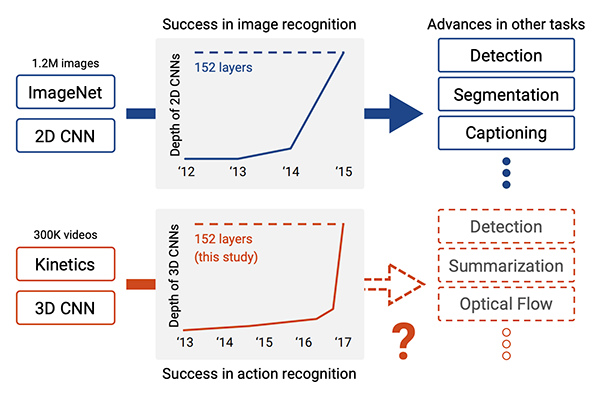

<h1> HUMAN ACTIVITY RECOGNITION </h1>

<h3> Task: </h3> Identify and recognize human activity from a video 
source and classify it based on the activity thus performed.  

<h3> About </h3>

 The main objective of this project is to Recognize Human Activities like doing yoga, motorcycling, boxing, playing guitar etc.   The Dataset used to train the model is Kinetics Dataset. This dataset consists of: 400 human activity class, more than 400 clips per class. The architecture used is 3D ResNet. The existing state of art of 2D architecture is extended to video classification using 3D kernels

<h3>Architecture Design</h3>

