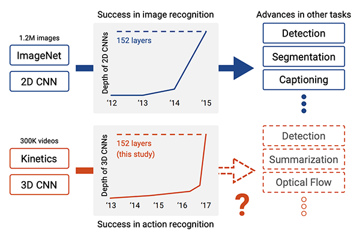

<h1> HUMAN ACTIVITY RECOGNITION </h1>

<h3> Task: </h3> Identify and recognize human activity from a video 
source and classify it based on the activity thus performed.  

<h3> About </h3>

 The main objective of this project is to Recognize Human Activities like doing yoga, motorcycling, boxing, playing guitar etc.   The Dataset used to train the model is Kinetics Dataset. This dataset consists of: 400 human activity class, more than 400 clips per class. The architecture used is 3D ResNet. The existing state of art of 2D architecture is extended to video classification using 3D kernels

<h3>Architecture Design</h3>

This model is from Hara et al.’s 2018 CVPR paper. In this paper, they have researched on how existing state-of-the-art 2D architectures can be extended to video classification via 3D kernels.  <b>3D convolutions</b>applies a 3 dimentional filter to the dataset and the filter moves 3-direction (x, y, z) to calcuate the low level feature representations. Their output shape is a 3 dimentional volume space such as cube or cuboid.  <b>Kinetics Dataset: </b> A collection of large-scale, high-quality datasets of URL links of up to 650,000 video clips that cover 400/600/700 human action classes, depending on the dataset version. The videos include human-object interactions such as playing instruments, as well as human-human interactions such as shaking hands and hugging. Each action class has at least 400/600/700 video clips. Each clip is human annotated with a single action class and lasts around 10 seconds.

<h3>Requirements:</h3>
<li>
	<ol>Python</ol>
	<ol>OpenCV</ol>
	<ol>Numpy</ol>
	<ol>resnet-34_kinetics.onnx (Kinetics Dataset) </ol>
</li>
<!-- * Python
* OpenCV
* Numpys
* resnet-34_kinetics.onnx -->

<h3>Setup: </h3>

